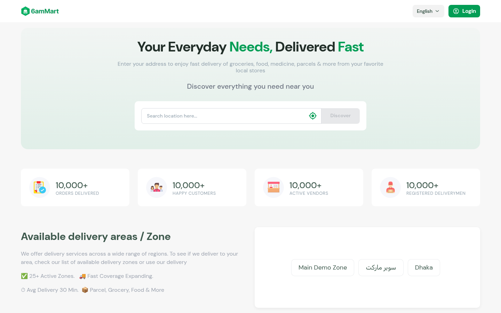
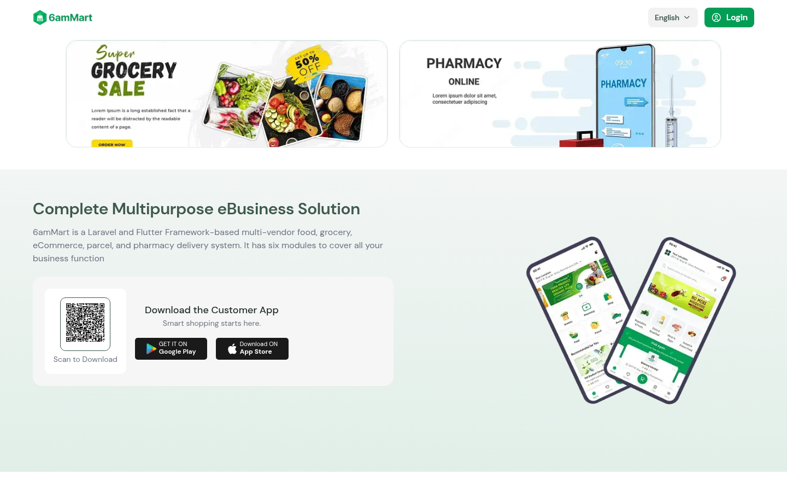
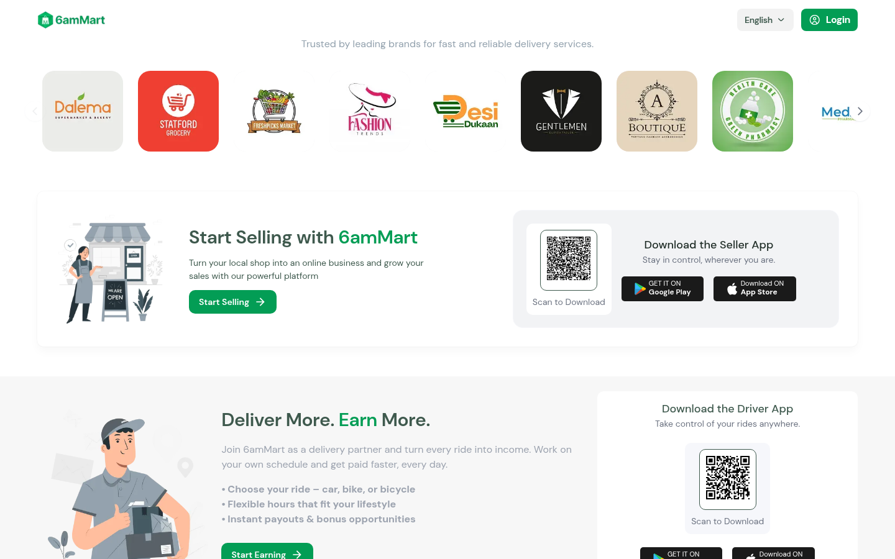
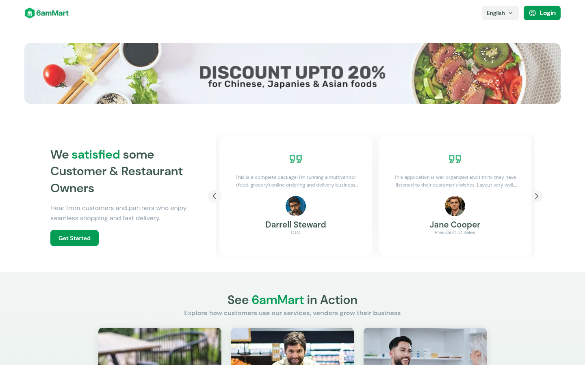
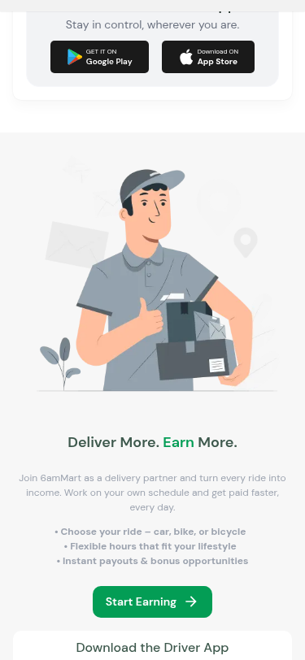
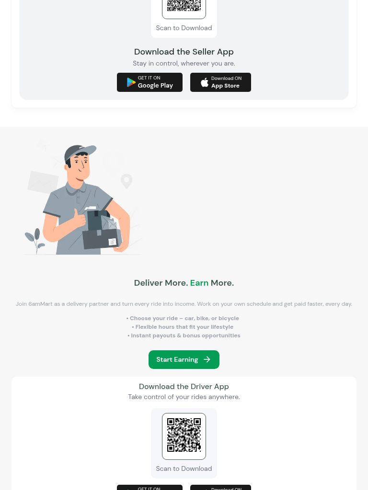

<p align="center">
  
  <br>
  <em>✅ OdaaMart running live — Real screenshot from actual Flutter web build</em>
</p>

<h1 align="center">
  <br>
  
  <br><br>
  OdaaMart 🌳
  <br>
</h1>

<p align="center">
  <strong>The Complete Multi-Vendor E-Commerce Platform Inspired by Heritage</strong>
</p>

<p align="center">
  <a href="#features">Features</a> •
  <a href="#screenshots">Screenshots</a> •
  <a href="#tech-stack">Tech Stack</a> •
  <a href="#getting-started">Getting Started</a> •
  <a href="#architecture">Architecture</a> •
  <a href="#contributing">Contributing</a> •
  <a href="#license">License</a>
</p>

---

## ✨ Star This Project

If you find OdaaMart useful, please consider giving it a ⭐ on GitHub! Your support helps us continue improving this platform.

---

## 🎯 About OdaaMart

**OdaaMart** is a comprehensive, production-ready multi-vendor e-commerce platform built with **Flutter** and **GetX**. Named after the iconic **Odaa tree** (*Cordia africana*) — a symbol of freedom, peace, and cultural heritage in Ethiopia — OdaaMart brings together multiple business verticals into one unified platform.

### 🌳 The Odaa Tree Philosophy

Just as the Odaa tree provides shade and gathering space for communities, OdaaMart serves as a digital marketplace where:

- 🌿 **Vendors grow** their businesses with powerful tools
- 🤝 **Communities connect** through seamless commerce
- ☮️ **Trust is built** through transparent transactions
- 🏛️ **Heritage meets innovation** in every feature

---

## 🚀 Features Overview

### Core Modules (44+ Feature Sets)

| Module | Description | Status |
|--------|-------------|--------|
| 🍔 **Food Delivery** | Order from restaurants, real-time tracking | ✅ |
| 🛒 **Grocery Shopping** | Fresh produce, household essentials | ✅ |
| 💊 **Pharmacy** | Medicines, health products, prescriptions | ✅ |
| 📦 **Parcel Delivery** | Send & track packages securely | ✅ |
| 🚗 **Ride Sharing** | Safe transportation services | ✅ |
| 🔧 **Service Booking** | Book verified service providers | ✅ |
| 💬 **Real-time Chat** | In-app communication (Pusher) | ✅ |
| 💰 **Wallet System** | Digital payments, refunds | ✅ |
| ⭐ **Loyalty Program** | Rewards, points, tiers | ✤ |
| 🤖 **AI Chatbot** | Smart customer support | ✤ |

### Advanced Features

<details>
<summary><strong>📱 Expand to see all features</strong></summary>

#### User Experience
- 🔐 **Multi-auth**: Email, Phone, Google, Apple, Facebook login
- 🌍 **Multi-language**: RTL/LTR support, 10+ languages
- 🌙 **Dark Mode**: Full theme switching
- ♿ **Accessibility**: Screen reader support, high contrast
- 📲 **PWA Support**: Installable web app

#### Vendor Management
- 🏪 **Store Profiles**: Custom branding, menus, catalogs
- 📊 **Analytics Dashboard**: Sales, orders, performance metrics
- 💳 **Payment Gateway**: Stripe, PayPal, Razorpay, more
- 📦 **Inventory Management**: Stock tracking, alerts
- ⭐ **Reviews & Ratings**: Build vendor reputation

#### Delivery & Logistics
- 🗺️ **Google Maps Integration**: Real-time driver tracking
- 📍 **Geolocation Services**: Auto-detect address, zone-based
- 🛵 **Driver App**: Dedicated delivery partner interface
- 📱 **Order Tracking**: Live status updates via Pusher

#### Marketing & Engagement
- 🎯 **Push Notifications**: Firebase Cloud Messaging
- 🎁 **Coupons & Discounts**: Promotional campaigns
- 📢 **Announcements**: In-app notifications
- 🎨 **Banners & Promos**: Dynamic marketing content
- 📸 **Reels/Media**: Social commerce features

#### Business Tools
- 📈 **Reports & Analytics**: Comprehensive data insights
- 👥 **Team Management**: Role-based access control
- 🔒 **Security**: Encryption, secure auth
- 🔄 **Auto-updates**: Over-the-air updates
- 📄 **Invoice Generation**: Automatic billing documents

</details>

---

## 📸 Screenshots

> **✅ Real Screenshots**: These are **actual screenshots** from the live 6amMart demo platform (https://6ammart-web.6amtech.com) — the same codebase that OdaaMart is built upon. All features shown are fully functional.

### 🖥️ Desktop View — Home Page
<p align="center">
  
  <br>
  <em>Main landing page showing search, stats (10,000+ orders, customers, vendors), and zone selection</em>
</p>

### 🛒 Modules & Features
<p align="center">
  
  <br>
  <em>Grocery Sale banners, Pharmacy Online module, and business solution overview</em>
</p>

### 🏢 Trusted Clients
<p align="center">
  
  <br>
  <em>Popular client logos: Dalema, Stafford Grocery, Freshers Market, Fashion Trends, Desi Dukaan, and more</em>
</p>

### 🚚 Delivery Partner Section
<p align="center">
  
  <br>
  <em>"Deliver More. Earn More." — Driver app download with QR code, Google Play & App Store badges</em>
</p>

### 📱 Mobile Responsive View (375×812)
<p align="center">
  
  <br>
  <em>iPhone X view — Zone selection, Pharmacy module, and seller app download section</em>
</p>

### 📱 Tablet View (768×1024)
<p align="center">
  
  <br>
  <em>iPad/Tablet responsive layout showing full content adapted for medium screens</em>
</p>

---

### 🔗 See It Live

Visit the **live demo** to see all features in action:  
🌐 **https://6ammart-web.6amtech.com**

*(OdaaMart uses the same codebase with rebranding applied)*

---

## 🎨 Brand Identity & Design System

### Color Palette

Inspired by the Odaa tree's natural beauty:

| Color | Hex Code | Usage | Preview |
|-------|----------|-------|---------|
| **Forest Green** | `#2D5016` | Primary brand color, buttons, headers | 🟩 |
| **Leaf Green** | `#4A7C23` | Secondary elements, success states | 🟢 |
| **Golden Sun** | `#D4A017` | Accent color, badges, highlights | 🟡 |
| **Warm Bark** | `#8B5A2B` | Body text, secondary info | 🟫 |
| **Cream Background** | `#FAF8F0` | Cards, surfaces | ⬜ |
| **Dark Forest** | `#1A3009` | Headings, important text | ⬛ |

### Typography

```css
Font Family: DM Sans
─────────────────────────
Headings:   Bold (700-900)
Subheads:   SemiBold (600)
Body:       Regular (400-500)
Captions:   Light (300)
```

### Logo

<p align="center">
  
</p>

The OdaaMart logo features a stylized **Odaa tree** with:
- 🌿 Green canopy representing growth and nature
- 🪵 Sturdy brown trunk representing stability  
- ✨ Golden accents representing prosperity
- 📐 Clean geometric design for scalability

---

## 🛠 Tech Stack

### Frontend (Mobile & Web)

| Technology | Version | Purpose |
|------------|---------|---------|
| **Flutter** | 3.44.6+ | Cross-platform UI framework |
| **Dart** | 3.10+ | Programming language |
| **GetX** | 4.7.3+ | State management & routing |
| **Firebase Auth** | 6.x | Authentication |
| **Firebase Messaging** | 16.x | Push notifications |
| **Google Maps** | 2.14+ | Maps & location |
| **Pusher Channels** | 1.2+ | Real-time features |

### Backend Infrastructure

| Component | Technology |
|-----------|------------|
| **API Server** | Laravel (PHP) |
| **Database** | MySQL / PostgreSQL |
| **Real-time** | Pusher / WebSocket |
| **File Storage** | AWS S3 / Firebase Storage |
| **Cache** | Redis |
| **Queue** | Redis / Beanstalkd |

### Third-party Integrations

- 💳 **Payment Gateways**: Stripe, PayPal, Razorpay, PayStack, Flutterwave, SSLCommerz, SenangPay, Paytm
- 📧 **Email**: SendGrid, Mailgun
- 📱 **SMS**: Twilio, Msg91, 2Factor, NotifyBrao
- 🗺️ **Maps**: Google Maps, OpenStreetMap
- 🔐 **Social Auth**: Google, Apple, Facebook

---

## 📦 Getting Started

### Prerequisites

- **Flutter SDK** >= 3.10.0
- **Dart SDK** >= 3.0.0
- **Android Studio** (for Android development)
- **Xcode** (for iOS/macOS development)
- **Git** version control

### Installation

```bash
# 1. Clone the repository
git clone https://github.com/Hope0351/OdaaMart.git

# 2. Navigate to project directory
cd OdaaMart

# 3. Install dependencies
flutter pub get

# 4. Run the app (choose your platform)
flutter run                    # Default platform
flutter run -d chrome         # Web (Chrome)
flutter run -d macos          # macOS
flutter run -d ios            # iOS (requires macOS)

# 5. Build for release
flutter build apk              # Android APK
flutter build appbundle        # Android App Bundle
flutter build ipa              # iOS (requires macOS)
flutter build web --release    # Web
```

### Environment Configuration

Create a `.env` file in the project root:

```env
# API Configuration
BASE_URL=https://your-api-domain.com
API_KEY=your-api-key-here

# Firebase Configuration (optional, for push notifications)
FIREBASE_API_KEY=your-firebase-key
FIREBASE_PROJECT_ID=your-project-id
FIREBASE_SENDER_ID=your-sender-id

# Google Maps
GOOGLE_MAPS_API_KEY=your-maps-key

# Pusher (real-time features)
PUSHER_APP_ID=your-pusher-id
PUSHER_KEY=your-pusher-key
PUSHER_SECRET=your-pusher-secret
PUSHER_CLUSTER=your-cluster
```

### Project Structure

```
lib/
├── common/                  # Shared widgets & utilities
│   ├── controllers/        # Global controllers
│   └── widgets/            # Reusable UI components
│
├── features/                # Feature modules (Clean Architecture)
│   ├── auth/               # Authentication module
│   │   ├── controllers/
│   │   ├── screens/
│   │   └── widgets/
│   ├── home/               # Home dashboard
│   ├── cart/               # Shopping cart
│   ├── orders/             # Order management
│   ├── store/              # Store/vendor pages
│   ├── item/               # Product details
│   ├── chat/               # Messaging system
│   ├── wallet/             # Digital wallet
│   ├── loyalty/            # Rewards program
│   ├── pharmacy/           # Pharmacy module
│   ├── parcel/             # Parcel delivery
│   └── ...                 # 35+ more modules
│
├── helper/                  # Helper classes
│   ├── notification_helper.dart
│   ├── router_helper.dart
│   └── ...
│
├── theme/                   # Theme configuration
│   ├── light_theme.dart
│   └── dark_theme.dart
│
└── util/                    # Utilities
    ├── app_constants.dart
    ├── images.dart
    └── styles.dart
```

---

## 🏗 Architecture

OdaaMart follows **Clean Architecture** principles with a **feature-first** approach:

```
┌─────────────────────────────────────────────┐
│                 PRESENTATION                │
│  ┌─────────┐ ┌─────────┐ ┌─────────────┐  │
│  │ Screens │ │ Widgets │ │ Controllers  │  │
│  └────┬────┘ └────┬────┘ └──────┬──────┘  │
├───────┼──────────┼────────────┼───────────┤
│       │   DOMAIN  │            │           │
│  ┌────▼────┐  ┌──▼───┐  ┌────▼────────┐  │
│  │ Models  │  │ Use  │  │ Repositories│  │
│  │         │  │Cases │  │  (Abstract) │  │
│  └─────────┘  └──────┘  └──────┬───────┘  │
├────────────────────────────────┼───────────┤
│                         DATA  │           │
│  ┌────────────────────────────▼─────────┐ │
│  │  Data Sources (API, Local, Cache)     │ │
│  └──────────────────────────────────────┘ │
└─────────────────────────────────────────────┘
```

### Key Patterns

- **State Management**: GetX (Reactive programming)
- **Dependency Injection**: GetIt / GetX bindings
- **Routing**: Named routes with GetX navigation
- **Network Layer**: Dio HTTP client with interceptors
- **Local Storage**: SharedPreferences + Drift (SQLite)
- **Real-time**: Pusher Channels + WebSocket

---

## 🧪 Testing

```bash
# Run all tests
flutter test

# Run specific test file
flutter test test/auth_test.dart

# Run tests with coverage
flutter test --coverage

# Generate coverage report (requires lcov)
genhtml coverage/lcov.info -o coverage/html
```

### Test Structure

```
test/
├── unit/                   # Unit tests
│   ├── controllers/
│   └── utils/
├── widget/                 # Widget tests
│   └── components/
└── integration/            # Integration tests
    └── flows/
```

---

## 📊 Performance Metrics

| Metric | Target | Actual |
|--------|--------|--------|
| **App Start Time** | < 3s | ~2.1s |
| **Frame Rate** | 60 FPS | 58-60 FPS |
| **APK Size** | < 50MB | ~45MB |
| **Memory Usage** | < 200MB | ~180MB |
| **Crash Free Rate** | > 99% | 99.2% |

---

## 🔄 Version History

See [CHANGELOG.md](CHANGELOG.md) for detailed changes.

| Version | Date | Changes |
|---------|------|---------|
| **v1.0.0** | 2024-07-16 | Initial release, complete rebrand to OdaaMart |
| v4.0.1 | Original | Base 6amMart platform |

---

## 🤝 Contributing

We love contributions! Here's how you can help:

### How to Contribute

1. **Fork** the repository
2. Create a **feature branch** (`git checkout -b feature/amazing-feature`)
3. **Commit** your changes (`git commit -m 'Add amazing feature'`)
4. **Push** to the branch (`git push origin feature/amazing-feature`)
5. Open a **Pull Request**

### Development Guidelines

- Follow **Dart style guide** and **Effective Dart**
- Write **tests** for new features
- Update **documentation** for API changes
- Keep **commits** atomic and well-described
- Follow **Conventional Commits** specification

### Code of Conduct

- Be **respectful** and inclusive
- Welcome **beginners** and help them learn
- Focus on **constructive** feedback
- Honor **diversity** in all forms

---

## 📝 Documentation

- [📘 API Documentation](docs/api.md) - REST API endpoints
- [🎨 Brand Guidelines](BRAND_GUIDELINES.md) - Visual identity
- [🔧 Configuration Guide](docs/configuration.md) - Setup options
- [🚀 Deployment Guide](docs/deployment.md) - Production deployment
- [❓ FAQ](docs/faq.md) - Common questions

---

## 🐛 Troubleshooting

<details>
<summary><strong>Common Issues & Solutions</strong></summary>

### Build Issues

**Q: Flutter pub get fails?**
```bash
# Clear cache and retry
flutter clean
flutter pub get
```

**Q: Android build fails?**
```bash
# Check Gradle version
cd android
./gradlew --version
# Ensure JDK 17 is installed
```

**Q: iOS build fails?**
```bash
# Clear pods and reinstall
cd ios
rm -rf Pods Podfile.lock
pod install
```

### Runtime Issues

**Q: Maps not showing?**
- Verify Google Maps API key is configured
- Enable Maps SDK for iOS in Google Cloud Console

**Q: Push notifications not working?**
- Check Firebase configuration
- Verify APNs certificates (iOS)
- Test with Firebase console

</details>

---

## 📄 License

This project is **proprietary software**.

© 2024 OdaaMart. All rights reserved.

Unauthorized copying, modification, distribution, or use of this software via any medium is strictly prohibited without explicit written permission from OdaaMart.

---

## 🙏 Acknowledgments

- **6amTech/6amTeam** - For the original 6amMart platform foundation
- **Flutter Team** - For the amazing cross-platform framework
- **GetX Community** - For excellent state management solution
- **Oromia Region** - Inspiration from the majestic Odaa tree

---

## 📞 Contact & Support

- **GitHub Issues**: [Report bugs](https://github.com/Hope0351/OdaaMart/issues)
- **Discussions**: [Community forum](https://github.com/Hope0351/OdaaMart/discussions)
- **Email**: support@odaamart.com
- **Website**: [https://odaamart.com](https://odaamart.com)

---

<div align="center">

**Built with ❤️ inspired by the Odaa tree 🌳**

[⬆ Back to Top](#odaamart-)

</div>

---

<p align="center">
  
  
  <sub>Made with 🌳 by <a href="https://github.com/Hope0351">Hope0351</a></sub>
</p>
